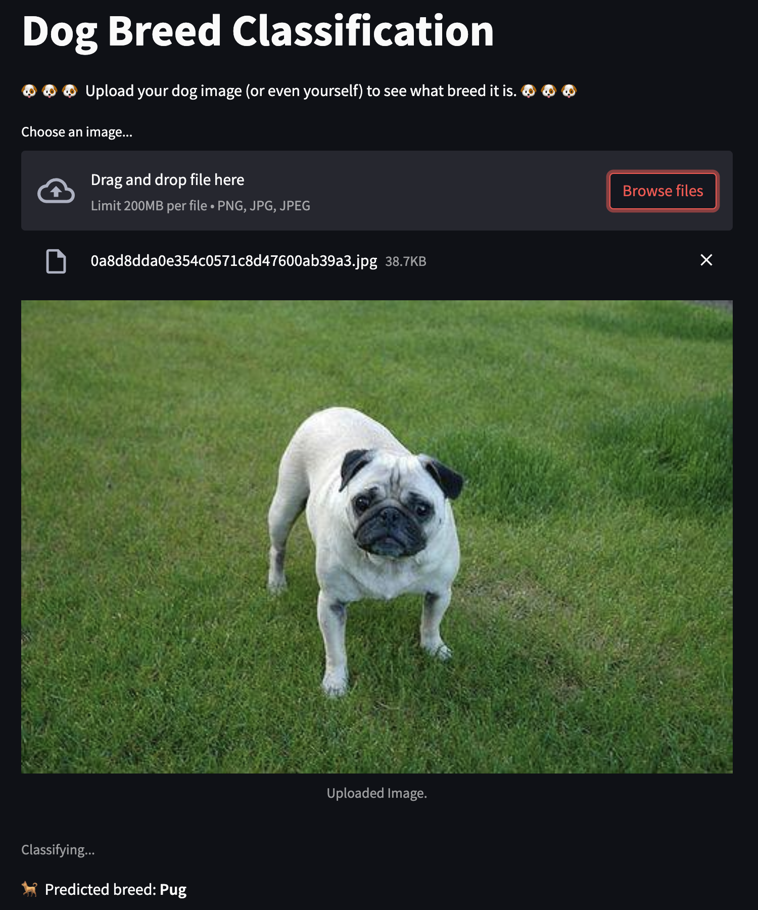

# Dog Breed Classification Example

Run the following command to test the app locally

```py
streamlit run https://raw.githubusercontent.com/titipata/dogbreed/master/st_dogbreed.py
```

This will load `inception_v3` pretrained model and the assigned
pretrained weights for dog breed classification. Then, we pass an
image to classify a dog breed.

## Example demo


